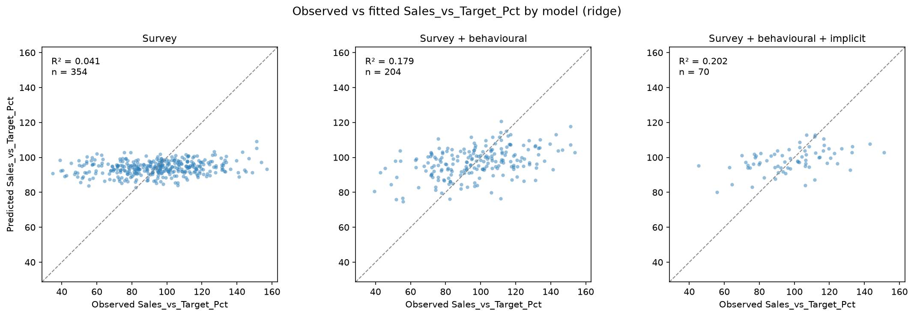
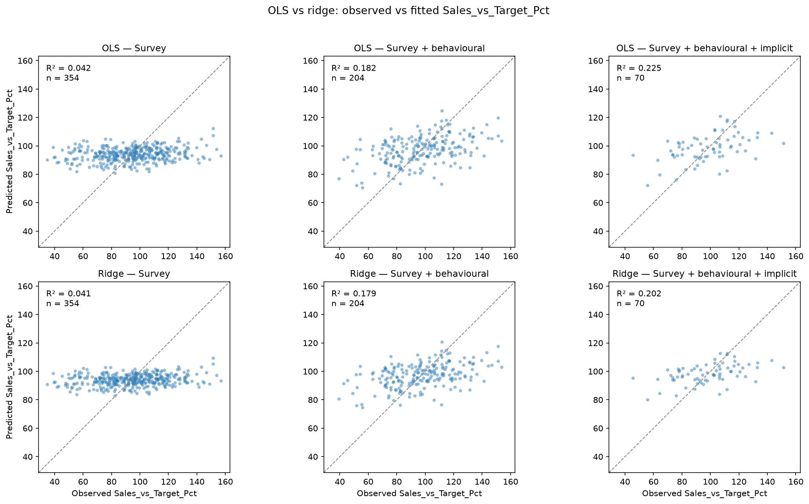
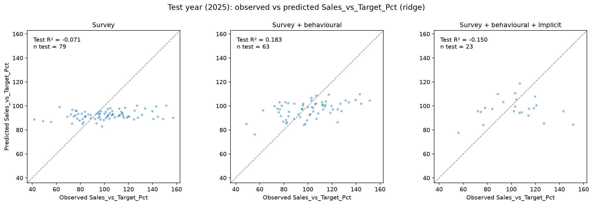
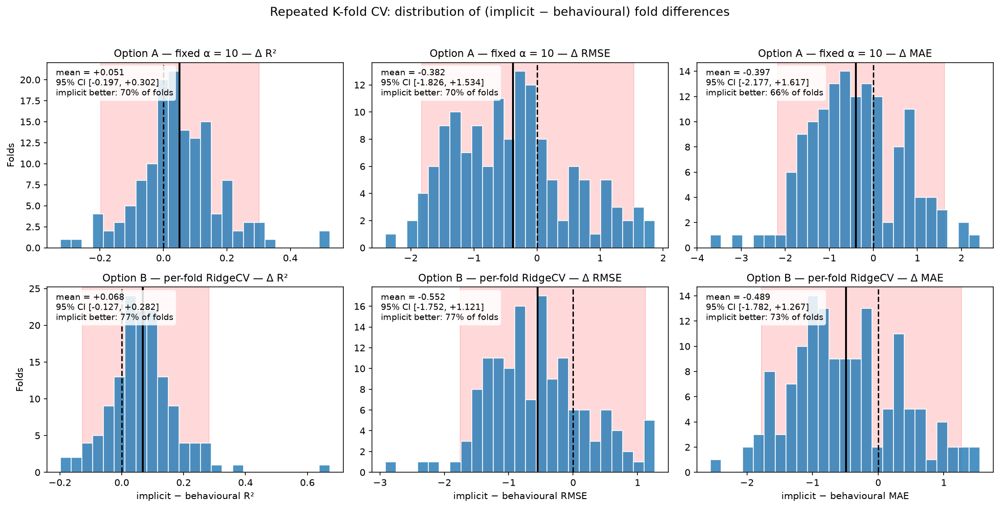
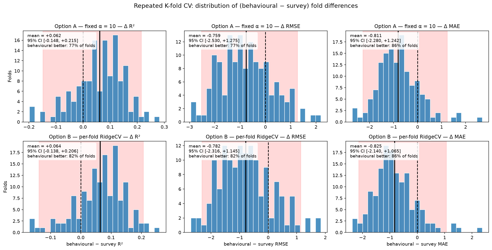

# Modelling — Target, Package Comparison, and Caveats
*Generated 2026-10-07 23:33:20*

## 1. Model target
The success outcome is binary, derived from ``Sales_vs_Target_Pct``: **success** when the value is at least 100, and **failure** otherwise. It is defined only for launched concepts (``Launched == 1``); of the 403 launched concepts, 32 lack ``Sales_vs_Target_Pct`` and are excluded (per-model deletion on the target), leaving 371 observations at an overall success rate of 39.9%.

## 2. Success by research package
Success is compared across packages to assess whether the extra cost and turnaround of the behavioural and combined (implicit) packages are reflected in higher success rates. Survey is the baseline; the difference columns are relative to Survey.

| Research package | n | Success rate (%) | Δ success vs Survey (pp) | Δ cost vs Survey (€) | Δ turnaround vs Survey (days) |
| --- | --- | --- | --- | --- | --- |
| Survey | 149 | 31.5 | — | — | — |
| Behavioural | 132 | 42.4 | +10.9 | +2,954 | +3.7 |
| Combined | 90 | 50.0 | +18.5 | +6,039 | +7.4 |

Success rises with research intensity: Survey 31.5% → Behavioural 42.4% → Combined 50.0% (χ² = 8.52, df = 2, p = 0.014). The Behavioural package buys a +10.9 pp success uplift over Survey, and the Combined package buys +18.5 pp. This is consistent with the behavioural/implicit measures adding predictive value, but the comparison is observational (see caveats) and not evidence of causation.

## 3. Caveats and limitations
**Predictive, not causal.** Packages were selected by teams according to need and resources, not randomised, so the package comparison supports prediction, not causation. A randomised pilot is required for causal claims.

**Outcome selection.** Outcomes exist only for launched concepts, and launch is pre-filtered by ``Recommendation`` (sometimes overridden). Results generalise to the launched sub-population only.

**Small ``Implicit_Score`` subsample.** Only 167 of 186 Combined concepts (10.2% missing) have ``Implicit_Score``, and the missingness mechanism is unconfirmed; treat coefficients on it cautiously.

**Non-stationary package mix.** Survey fell from 59% to 21% over 2022–2025. Use a time-ordered split (train 2022–2024, test 2025) to avoid leakage and reflect current conditions.

**Feature availability and ``"NA"`` handling.** Behavioural/implicit metrics exist only for their packages; ``"NA"`` markers are absent-by-design and must be excluded from features and targets, or the model leaks launch/package information.

**Collinearity and modest signal.** Cost and turnaround correlate r ≈ 0.81 and track ``Launch_Support_EUR``; the strongest cross-phase signal is moderate (r ≈ 0.4–0.5), so expect modest performance — report uncertainty, not point estimates.

**Balance, costs, and scope.** Check class balance per target (avoid accuracy alone); costs are nominal euros; single-context data may not generalise.

## 4. First model — linear regression on survey measures
A first, straightforward model regresses ``Sales_vs_Target_Pct`` on the survey (stated) measures ``Stated_Appeal`` and ``Purchase_Intent`` using scikit-learn's ``LinearRegression``. It is fit on launched concepts only (the target is launch-phase), after per-model deletion on the two predictors and the target.

| Term | Coefficient |  | Key | Value |
| --- | --- | --- | --- | --- |
| Intercept | 61.336 |  | Observations (n) | 354 |
| Stated_Appeal | 3.064 |  | R² | 0.042 |
| Purchase_Intent | 4.452 |  | Adjusted R² | 0.037 |

The model explains only 4.2% of the variance in ``Sales_vs_Target_Pct``. A one-point increase in ``Stated_Appeal`` is associated with a +3.06 pp change and a one-point increase in ``Purchase_Intent`` with +4.45 pp. The fit is weak, consistent with the earlier finding that stated measures carry little cross-phase predictive signal. This is an in-sample fit; out-of-sample evaluation on a time-ordered holdout is the next step.

## 5. Second model — adding the behavioural measure
``Behavioural_Choice_Pct`` is added to the survey measures. Because it is collected only for Behavioural and Combined packages, this model is restricted to that subset; the survey-only baseline is refit on the same complete cases so the increment is comparable.

| Term | Coefficient |  | Key | Value |
| --- | --- | --- | --- | --- |
| Intercept | 47.431 |  | Observations (n) | 204 |
| Stated_Appeal | 2.572 |  | Baseline R² (same subset) | 0.109 |
| Purchase_Intent | 4.226 |  | Model R² | 0.182 |
| Behavioural_Choice_Pct | 0.623 |  | Model adjusted R² | 0.170 |

Adding ``Behavioural_Choice_Pct`` raises R² from 10.9% to 18.2% (+7.4 pp). Each +1 pp in ``Behavioural_Choice_Pct`` is associated with a +0.62 pp change in ``Sales_vs_Target_Pct``, consistent with the exploratory finding that the behavioural measure is a stronger predictor than the stated measures. The sample is smaller (Behavioural/Combined concepts only) and this remains an in-sample fit.

## 6. Third model — adding the implicit measure
``Implicit_Score`` is added to the survey and behavioural measures. Because it is collected only for Combined packages, this model is restricted to that subset; the survey-plus-behavioural baseline is refit on the same complete cases so the increment is comparable.

| Term | Coefficient |  | Key | Value |
| --- | --- | --- | --- | --- |
| Intercept | 51.460 |  | Observations (n) | 70 |
| Stated_Appeal | 1.478 |  | Baseline R² (same subset) | 0.185 |
| Purchase_Intent | -0.230 |  | Model R² | 0.225 |
| Behavioural_Choice_Pct | 0.550 |  | Model adjusted R² | 0.178 |
| Implicit_Score | 0.401 |  |  |  |

Adding ``Implicit_Score`` raises R² from 18.5% to 22.5% (+4.0 pp), a smaller increment than the behavioural measure. The sample is very small (n = 70, Combined launched concepts only) and ``Purchase_Intent``'s coefficient flips sign, a symptom of collinearity among the four measures; individual coefficients should be read cautiously, consistent with the ``Implicit_Score`` small-subsample and collinearity caveats.

## 7. Visualising the model fits
The three regressions are shown side by side as observed-vs-fitted scatter plots, produced by ``visualisation.plot_regression_fits``. Each panel plots the model's predicted ``Sales_vs_Target_Pct`` against the observed value, with the dashed identity line marking a perfect prediction, and is annotated with its R² and sample size. The panels share identical axis limits so the spread of points relative to the diagonal is directly comparable across models. The usable sample shrinks across the panels because each model is restricted to the concepts for which its predictors exist, as noted in sections 4–6.

## 8. Ridge regression — controlling for collinearity
The exploration phase showed the research measures are inter-correlated, and this collinearity caused ``Purchase_Intent``'s coefficient to flip sign in the implicit model. The same three-stage regression is therefore refit with ridge regression (scikit-learn's ``RidgeCV``) to control for collinearity. Predictors are standardised to z-scores so the L2 penalty treats each variable equally, and the regularisation strength (alpha) is selected by leave-one-out cross-validation. Coefficients are reported per +1 standard deviation of each predictor, so they are not directly comparable to the raw-unit coefficients in sections 4–6.

### Survey
| Term | Coefficient |  | Key | Value |
| --- | --- | --- | --- | --- |
| Intercept | 94.060 |  | Observations (n) | 354 |
| Stated_Appeal | 1.962 |  | Alpha | 100.0 |
| Purchase_Intent | 2.817 |  | R² | 0.041 |

### Survey + behavioural
| Term | Coefficient |  | Key | Value |
| --- | --- | --- | --- | --- |
| Intercept | 97.238 |  | Observations (n) | 204 |
| Stated_Appeal | 1.923 |  | Alpha | 50.0 |
| Purchase_Intent | 3.233 |  | R² | 0.179 |
| Behavioural_Choice_Pct | 5.565 |  |  |  |

### Survey + behavioural + implicit
| Term | Coefficient |  | Key | Value |
| --- | --- | --- | --- | --- |
| Intercept | 98.509 |  | Observations (n) | 70 |
| Stated_Appeal | 0.761 |  | Alpha | 50.0 |
| Purchase_Intent | 1.053 |  | R² | 0.202 |
| Behavioural_Choice_Pct | 3.839 |  |  |  |
| Implicit_Score | 3.219 |  |  |  |

Ridge regularisation stabilises the coefficients: ``Purchase_Intent`` is now positive in all three models (unlike its negative OLS coefficient in the implicit model), confirming the sign flip was a collinearity artefact. The in-sample R² is slightly lower than OLS — for the implicit model 0.202 versus 0.225 — the expected cost of shrinkage in exchange for more stable, better-conditioned estimates.

The ridge fits are shown below in the same observed-vs-fitted format as section 7, for a direct visual comparison with the OLS panels. The predictions are in the original ``Sales_vs_Target_Pct`` units — only the predictors were standardised, not the target.

## 9. OLS vs ridge comparison
The OLS and ridge models are compared directly. Ridge coefficients are on the standardised (per-SD) scale, so the OLS coefficients are recomputed on the same standardised predictors (``ridge_model(..., alpha=0.0)``) to make the two directly comparable; on this scale the intercept is the mean target at the predictor means. R² is scale-invariant and therefore matches the raw-unit OLS values in sections 4–6.

### Fit metrics
| Model | n | OLS R² | Ridge R² | Alpha |
| --- | --- | --- | --- | --- |
| Survey | 354 | 0.042 | 0.041 | 100.0 |
| Survey + behavioural | 204 | 0.182 | 0.179 | 50.0 |
| Survey + behavioural + implicit | 70 | 0.225 | 0.202 | 50.0 |

### Survey
| Term | OLS (per SD) | Ridge (per SD) |
| --- | --- | --- |
| Intercept | 94.060 | 94.060 |
| Stated_Appeal | 2.227 | 1.962 |
| Purchase_Intent | 3.501 | 2.817 |

### Survey + behavioural
| Term | OLS (per SD) | Ridge (per SD) |
| --- | --- | --- |
| Intercept | 97.238 | 97.238 |
| Stated_Appeal | 1.898 | 1.923 |
| Purchase_Intent | 3.542 | 3.233 |
| Behavioural_Choice_Pct | 6.814 | 5.565 |

### Survey + behavioural + implicit
| Term | OLS (per SD) | Ridge (per SD) |
| --- | --- | --- |
| Intercept | 98.509 | 98.509 |
| Stated_Appeal | 1.119 | 0.761 |
| Purchase_Intent | -0.174 | 1.053 |
| Behavioural_Choice_Pct | 6.196 | 3.839 |
| Implicit_Score | 5.033 | 3.219 |

Ridge shrinks every coefficient toward zero relative to OLS and, most importantly, stabilises ``Purchase_Intent`` — negative in the OLS implicit model but positive in every ridge model — confirming the sign flip was a collinearity artefact. The fit-metrics table shows the in-sample R² drops only slightly under ridge, the modest cost of the stabilisation.

The OLS (top row) and ridge (bottom row) fits are shown below on identical axis limits, so the spread of points relative to the identity line is directly comparable across all six panels.

## 10. Time-ordered validation: train 2022–2024, test 2025
To obtain an honest out-of-sample estimate, the ridge regressions are refit on 2022–2024 data only and used to predict the held-out 2025 concepts. The scaler and the cross-validated regularisation strength (alpha) are derived from the training years alone and applied unchanged to 2025, so nothing from the test year leaks into the fit. This split also respects the non-stationary package mix noted in the caveats: 2025 is the year in which the behavioural and implicit packages are most common, so it is the strictest test of whether the model generalises.

### Survey
| Term | Coefficient |
| --- | --- |
| Intercept | 92.123 |
| Stated_Appeal | 1.051 |
| Purchase_Intent | 2.691 |

### Survey + behavioural
| Term | Coefficient |
| --- | --- |
| Intercept | 95.533 |
| Stated_Appeal | 1.849 |
| Purchase_Intent | 2.497 |
| Behavioural_Choice_Pct | 4.979 |

### Survey + behavioural + implicit
| Term | Coefficient |
| --- | --- |
| Intercept | 96.366 |
| Stated_Appeal | -0.718 |
| Purchase_Intent | -4.127 |
| Behavioural_Choice_Pct | 7.755 |
| Implicit_Score | 3.455 |

### Out-of-sample metrics
| Model | n train | n test | Alpha | Train R² | Test R² | RMSE | MAE |
| --- | --- | --- | --- | --- | --- | --- | --- |
| Survey | 275 | 79 | 100.0 | 0.030 | -0.071 | 24.1 | 19.0 |
| Survey + behavioural | 141 | 63 | 50.0 | 0.148 | 0.183 | 19.4 | 15.5 |
| Survey + behavioural + implicit | 47 | 23 | 10.0 | 0.288 | -0.150 | 24.1 | 19.2 |

The test-year R² is the honest measure of predictive value. The survey-only model does not generalise — its test R² is negative, meaning it predicts 2025 no better (in fact slightly worse) than simply using the test-year mean. Adding the behavioural measure is the step that genuinely helps: it is the only model with a positive out-of-sample R². Adding the implicit measure on top is counter-productive in this split — despite the highest in-sample fit (train R² = 0.288), its test R² is negative because it is fit on only 47 training concepts (23 in the test year), the smallest subsample of the three, so the extra predictor overfits and fails to generalise to 2025. This is exactly the small-``Implicit_Score``-subsample risk flagged in the caveats, and it cautions against reading the implicit model's in-sample gains as real predictive value.

The out-of-sample predictions are shown below in the same observed-vs-predicted format as sections 7–9. Each panel is annotated with the test-year R² and the number of 2025 test observations; points are the held-out 2025 concepts, not the training data used to fit the models.

## 11. Repeated K-fold CV — isolating the implicit measure's contribution
A single 2025 hold-out (23 concepts) cannot tell whether the implicit model's failure reflects a hard fold or too few points. Repeated K-fold cross-validation replaces that one split with many random splits of the shared 70-case implicit subsample. On every fold the behavioural and implicit models are fit on the *same* training cases and evaluated on the *same* test cases, and the within-fold difference (implicit − behavioural) is recorded. Because the folds are paired, any overall difficulty of a fold cancels out, and the distribution of differences isolates what ``Implicit_Score`` adds. Two regularisation strategies are compared: a fixed α (option A), so the only difference between the models is the predictor set, and a per-fold cross-validated α (option B), which pits the best-tuned implicit model against the best-tuned behavioural model.

### Option A — fixed regularisation (α = 10)
Both models share the same fixed α = 10, so the only difference between them is the predictor set. Over 140 folds the behavioural model's fold R² averages -0.145 and the implicit model's -0.095. These fold-level R² values are negative on average only because each test fold holds ~10 points, so the per-fold R² is very noisy; the paired Δ, which cancels this fold-to-fold noise, is the quantity that matters.

| Metric | Mean | SD | Median | 95% CI | Implicit better (% of folds) |
| --- | --- | --- | --- | --- | --- |
| Δ R² | +0.051 | 0.130 | +0.040 | [-0.197, +0.302] | 70 |
| Δ RMSE | -0.382 | 0.926 | -0.413 | [-1.826, +1.534] | 70 |
| Δ MAE | -0.397 | 1.057 | -0.477 | [-2.177, +1.617] | 66 |

### Option A — sensitivity to α
| α | Mean ΔR² | 95% CI | Implicit better (% of folds) |
| --- | --- | --- | --- |
| 0 | +0.048 | [-0.252, +0.381] | 63 |
| 10 | +0.051 | [-0.197, +0.302] | 70 |
| 50 | +0.052 | [-0.127, +0.207] | 75 |

### Option B — per-fold cross-validated α
Each model selects its own α by leave-one-out cross-validation on the training fold, so this compares the best-tuned implicit model against the best-tuned behavioural model.

| Metric | Mean | SD | Median | 95% CI | Implicit better (% of folds) |
| --- | --- | --- | --- | --- | --- |
| Δ R² | +0.068 | 0.110 | +0.061 | [-0.127, +0.282] | 77 |
| Δ RMSE | -0.552 | 0.760 | -0.585 | [-1.752, +1.121] | 77 |
| Δ MAE | -0.489 | 0.827 | -0.599 | [-1.782, +1.267] | 73 |

Both strategies tell the same story. Under option A the mean ΔR² is +0.051 with a 95% percentile interval of [-0.197, +0.302], and the implicit model beats the behavioural model on 70% of folds; under option B the mean ΔR² is +0.068 with interval [-0.127, +0.282]. Because option A and option B agree in direction and magnitude, the conclusion is not an artefact of fine-tuning the regularisation. The RMSE and MAE differences point the same way: the implicit model's average out-of-sample error is lower (negative Δ), so it is not simply trading variance in R² for a worse absolute fit.

Read against the single time-ordered split, this is the sample-size explanation, not a difficult-fold artefact. Where the 2025 hold-out put the implicit model's test R² at −0.150 against the behavioural model's +0.183 — a Δ of about −0.33 — the 140 random folds give a mean ΔR² of roughly +0.05 to +0.07, positive on ~70% of folds. The single negative result is therefore the product of one small, hard fold rather than evidence that the implicit measure *hurts* prediction. At the same time, every 95% interval still straddles zero, so the 70-case sample is too small to confirm that the positive effect is real. That is precisely the case for a pilot study: the point estimate favours the implicit measure, but confirming it requires more implicit data than the current sample provides.

## 12. Repeated K-fold CV — behavioural vs survey
The same paired repeated K-fold design is applied one step earlier, to ask whether ``Behavioural_Choice_Pct`` adds predictive value over the survey-only model. Both models are restricted to the shared behavioural subsample — the launched concepts for which ``Behavioural_Choice_Pct`` is applicable (Behavioural and Combined packages) — so, as before, the only difference between the two models is the predictor set, and any fold difficulty cancels out in the paired difference.

### Option A — fixed regularisation (α = 10)
Over 140 folds on the 204-case behavioural subsample, the survey model's fold R² averages 0.039 and the behavioural model's 0.100.

| Metric | Mean | SD | Median | 95% CI | Behavioural better (% of folds) |
| --- | --- | --- | --- | --- | --- |
| Δ R² | +0.062 | 0.090 | +0.075 | [-0.148, +0.215] | 77 |
| Δ RMSE | -0.759 | 1.017 | -0.842 | [-2.530, +1.275] | 77 |
| Δ MAE | -0.811 | 0.850 | -0.874 | [-2.280, +1.242] | 86 |

### Option A — sensitivity to α
| α | Mean ΔR² | 95% CI | Behavioural better (% of folds) |
| --- | --- | --- | --- |
| 0 | +0.061 | [-0.160, +0.226] | 76 |
| 10 | +0.062 | [-0.148, +0.215] | 77 |
| 50 | +0.064 | [-0.114, +0.187] | 82 |

### Option B — per-fold cross-validated α
| Metric | Mean | SD | Median | 95% CI | Behavioural better (% of folds) |
| --- | --- | --- | --- | --- | --- |
| Δ R² | +0.064 | 0.081 | +0.074 | [-0.138, +0.206] | 82 |
| Δ RMSE | -0.782 | 0.903 | -0.868 | [-2.316, +1.145] | 82 |
| Δ MAE | -0.825 | 0.764 | -0.937 | [-2.140, +1.065] | 86 |

Both strategies again agree. The mean ΔR² is +0.062 (option A, 95% interval [-0.148, +0.215]) and +0.064 (option B, interval [-0.138, +0.206]), with the behavioural model beating the survey model on 77% of folds, and the RMSE/MAE differences pointing the same way. The behavioural advantage is therefore robust to how regularisation is set.

The behavioural measure shows a clear, consistent positive effect — larger in magnitude and on a much larger sample (204 vs 70 cases) than the implicit measure's — yet its 95% interval still straddles zero. That is the important cross-check: even the behavioural measure, whose value the time-ordered split supported (test R² +0.183 vs −0.071), cannot be confirmed as statistically significant under repeated resampling at the current sample size. The implicit measure's failure to reach significance in section 11 is therefore not evidence against it — it fails the same test the behavioural measure fails — but rather a sample-size limitation that a pilot study is designed to resolve.

